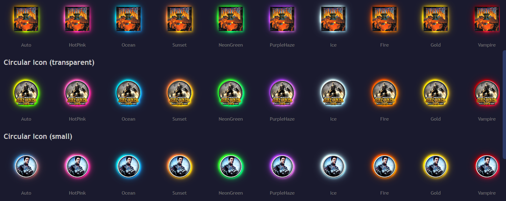

# BeautyCons Playnite Extension

   

<p align="center">
  
</p>

<p align="center">
  <a href="https://ko-fi.com/Z8Z11SG2IK">
    
  </a>
</p>

A Playnite extension that adds beautiful glow effects, metallic shimmer, and transform animations to Desktop game icons in the detail view.

Built with the help of Claude Code and Cursor IDE

---

<p align="center">
  
</p>

---

## Features

### Glow & Color

8 glow styles with 13+ color presets or auto-extracted icon colors.



| Style | Description |
|-------|-------------|
| Neon | Multi-layer additive glow with gradient separation |
| Soft | Wide dreamy single-layer glow |
| Sharp | Tight bright edge highlight |
| Bloom | Overexposed center with wide soft falloff |
| Halo | Soft ring around the icon |
| Diamond / Cross / Star | Geometric shape-based glows |

### Static Effects

Applied to the icon surface — visible even without animations running.

| Effect | Description |
|--------|-------------|
| **Metallic Luster** | Per-pixel directional lighting — saturates and brightens the lit side, dims the shadow side. Tints per shine style |
| **Effect Shape** | Square (directional sweep) or Circular (orbiting, clipped to icon bounds) |
| **Shadow Drift** | Glow shifts opposite to tilt for a depth shadow illusion |
| **Parallax** | Glow layer offsets opposite to tilt, creating depth between glow and icon |

### Animated Effects

Motion and shimmer effects with configurable speed, timing, and pauses.

| Effect | Description |
|--------|-------------|
| **Shimmer** | Diagonal shine bar (square) or orbiting highlight spot (circular) |
| **Shine Sweep** | Standalone WPF shine bar or orbiting ellipse |
| **Tilt** | Subtle skew synchronized with shimmer cycle |
| **Levitation** | Slow continuous sine-wave float up and down |
| **3D Rotation** | Fake perspective turntable — icon appears to rotate left and right |
| **Hover** | Mouse-reactive tilt, scale, and levitation |
| **Breathing Scale** | Slow continuous scale pulse |
| **Pulse** | Glow opacity breathes in and out |
| **Color Cycle** | Glow hue shifts gradually over time |
| **Sparkles** | Bright dots spawn, drift, and fade around the glow |
| **Spin** | Glow rotates around the icon |

### Shine Styles

6 luster tints: **White**, **Gold**, **Platinum**, **Crimson**, **Holographic**, **Icon Colors**

### Theme Presets

13 quick-apply presets for Square and Circular icons. Use as starting points, then customize.

---

## Installation

1. Download the `.pext` from [Releases](https://github.com/aHuddini/BeautyCons/releases)
2. In Playnite: **Add-ons → Install from file**
3. Restart Playnite

---

## Settings

Settings → BeautyCons. Tabs: **General**, **Icon Glow**, **Presets**, **About**, **Preview**. All changes apply immediately.

---

## Known Limitations

- Effects render at display resolution (~48px), not source resolution
- Visual tree injection depends on Playnite theme structure — some themes may not be compatible
- Circular shape is a manual setting — auto-detection isn't possible
- Luster uses CPU-based SkiaSharp rendering

---

## Requirements

- Playnite 10+ (SDK 6.15.0)
- Desktop mode only
- Windows x64

---

## Building

```bash
dotnet build src/BeautyCons.csproj -c Release
.\scripts\package_extension.ps1
```

---

## Credits

Built with [SkiaSharp](https://github.com/mono/SkiaSharp) and [Playnite SDK](https://playnite.link/). Luster techniques inspired by [pokemon-cards-css](https://github.com/simeydotme/pokemon-cards-css).

## License

[MIT](LICENSE)
