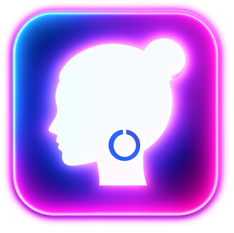
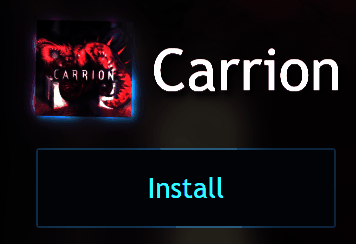
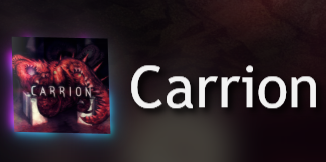

# BeautyCons Playnite Extension

   

<p align="center">
  
</p>

<p align="center">
  <a href="https://ko-fi.com/Z8Z11SG2IK">
    
  </a>
</p>

A Playnite extension that adds glow effects, metallic shimmer, and transform animations to game icons in the detail view.

Built with the help of Claude Code and Cursor IDE

---

<p align="center">
  
</p>

---

## Features

- **8 Glow Styles** — Neon, Soft, Sharp, Bloom, Halo, Diamond, Cross, Star with 13+ color presets
- **Shimmer** — Diagonal shine bar or orbiting highlight spot with style-specific tinting
- **Metallic Luster** — Per-pixel directional lighting (Gold, Platinum, Crimson, Holographic, Icon Colors)
- **Levitation** — Slow continuous float
- **3D Rotation** — Fake perspective turntable
- **Tilt, Hover, Breathing Scale** — Subtle motion effects
- **Shadow Drift / Parallax** — Glow shifts opposite to tilt for depth
- **Sparkles, Pulse, Color Cycle, Spin** — Glow animations
- **Effect Shape** — Square (directional sweep) or Circular (orbiting, clipped to bounds)
- **Theme Presets** — Quick-apply across 5 categories: Glow Only, Metallic, Ambient, Signature, Showcase



---

## Installation

1. Download the `.pext` from [Releases](https://github.com/aHuddini/BeautyCons/releases)
2. In Playnite: **Add-ons → Install from file**
3. Restart Playnite

---

## Settings

Settings → BeautyCons. Tabs: **General**, **Icon Glow**, **Presets**, **About**, **Preview**. All changes apply immediately.

---

## Known Limitations

- Effects render at display resolution (~48px), not source resolution
- Visual tree injection depends on Playnite theme structure — some themes may not be compatible
- Circular shape is a manual setting — auto-detection isn't possible
- Luster uses CPU-based SkiaSharp rendering

---

## Requirements

- Playnite 10+ (SDK 6.15.0)
- Desktop mode only
- Windows x64

---

## Building

```bash
dotnet build src/BeautyCons.csproj -c Release
.\scripts\package_extension.ps1
```

---

## Credits

Built with [SkiaSharp](https://github.com/mono/SkiaSharp) and [Playnite SDK](https://playnite.link/). Luster techniques inspired by [pokemon-cards-css](https://github.com/simeydotme/pokemon-cards-css).

## License

[MIT](LICENSE)
